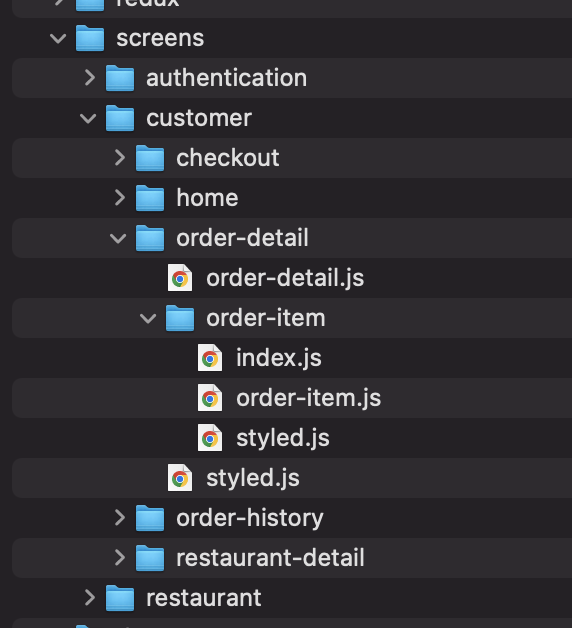

# React Native Development Guidelines

## What is React Native
React Native basically builds apps for both android and IOS platforms using a single code base, i.e. JavaScript.
Open source framework that helps you create real and exciting mobile apps
Developed by Facebook in 2015
Build cross-platform apps using JavaScript
Just learn once and code once, and then React Native apps are available for both iOS and Android platforms

## When to choose React Native
- When your App needs a native look and feels depending on the specific platforms.
- More scalable and complex app.
- Large number of community support packages available for faster development.
## When not to choose React Native
- Large scale project having heavy calculations and animations involved.
- Apps with complex user interfaces
- Apps that are designed for a single OS
- Games and apps that require Native APIs

## Project Setup Architecture

For large scale projects we should create 2 different repositories , 
- Components library containing Reuseable components (UI library for all the common resusable components that can be used across the app) 
- Main App Repo that will be consuming the above UI library to build scalabele and consistent screens.
- Ideally we should ensure encapsulation of screens and components.

Each root level folder exposes respective index.js file that helps us shorten the imports.
Everything inside a folder is exported from the index file of that respective directory

File names are in kebab-case which is hyphenated-like-this
index.js files must be used in each directory for shorter imports
If a file / concern spans on multiple files, create a separate directory for it

 

### High Level Architecture

### Screen Level Architecture

### Logical Architecture

## Setup a Theming Guidelines:
Without consistent styling, it's hard to get the best possible results. A Design System is a set of rules and principles that set the foundation for how the application should look and feel. You need 3 things to keep in mind while working with your design system.
- `Spacing`: While working with a cross-platform application, the screen sizes might vary between different components present on a screen, but make sure to provide consistent spacing between them for a coherent look.
- `Color`: Choosing the right colors is not only the most important thing but also how you use them. A great solution is to use Color Palettes, where you can name your colors according to the preferred naming conventions, which increases your overall workflow.
- `Typography`: We often forget about how the fonts change the way our application look in the results. It’s best to stick to a limited set of font families, weights, and sizes to achieve a pleasant coherent look.

## Dynamic Styling with JS
`Styled-components` is a CSS-in-JS styling framework that uses tagged template literals in JavaScript and the power of CSS to provide a platform that allows you to write actual CSS to style React components.
Styled components are easy-to-make React components that you write with the styled-components library, where you can style your components with plain CSS inside your JavaScript code
## Responsive Style Properties
Define some scalable functions that can help to handle UI on different device dimensions. Refer to the `react-native-normalize` for reference 

## React Native Best Coding Practices

- Organize imports such that all library imports are grouped together on top of the file, and rest imports will follow later
- Exception Handling in React Native Apps
- Sort all object properties.
- Always terminate properties with semicolons.
- Use stateless components as much as you can.
- Avoid default exports and use named exports for better IDE support.
- No Implicit returns
- Empty states should be implemented implicitly.
- To use any package, the priority should be given to the react-native community.
- Add comments in the code to clear ambiguity
- Stories to be placed under the storybook/stories folder.
- Use Platform Specific Styles
- Always Assign Unique Key to Each Element
- Remove deprecated & unnecessary commented code.
- Remove consoles.
- Shouldn’t pass inline functions in JSX.
- Props and Styles should be in a separate file
- Avoid Inline Styling
- Should remove repeated code and follow the DRY principle.
-If the file/component is too large, then it should be separated into multiple files/components.
- Should follow the style guides for styled files..
- Code has appropriate unit tests and should achieve coverage more than 80%.
-Tests are well-designed
- Lock Dependencies

 

## Code Quality

###  Configure Absolute Relative Paths in Codebase

Using absolute imports to better organize your React project is a great way. Relative imports are hard to follow and break during refactoring. Absolute imports manage your project easier as it grows.

Absolute imports have some advantages.

- There is no ../../../../hell. Therefore easier to type out the imports.
- Easily copy-paste the code with imports into another file in the project and not have to tinker with import paths.
- It is short and sweet

### Linting:
Use a linter to make your code easier to review.
Follow strict linting rules. This in turn helps you write clean, consistent code.
Rules recommendation: [ESlint Community Rules](https://www.npmjs.com/package/@react-native-community/eslint-config)

## Some Recommended Libraries to use: 

- `Redux` (If performance is a concern, the best way to improve performance is to skip unnecessary re-renders, so that components only re-render when their data has actually changed. React Redux implements many performance optimizations internally, so that your own component only re-renders when it actually needs to.)
- `Styled Components` ( Styled components are easy-to-make React components that you write with the styled-components library, where you can style your components with plain CSS inside your JavaScript code)
- `React Navigation` (It is one of the most widely used and actively developed libraries out there on the scene. It is also one of the solutions recommended by the React Native team. It’s the community solution being most pushed by Facebook.)
- `Reanimated`  (It’s a library that replaces RN’s Animated API, providing JS-based animation APIs that are easy to use and run on the native thread (which entails performance out of the box )
- `Community Hooks` (​​React Native APIs turned into React Hooks allowing you to access asynchronous APIs directly in your functional components and provides you many handy hooks to use)
- `Formik` (It is a small group of React components and hooks for building forms in React and React Native. It helps with the three most annoying parts: Getting values in and out of form state. Validation and error messages.)
- `React Native Fast Image` (Its really a cool library to load the image at a very fast speed. FastImage component from react-native-fast-image is a wrapper around SDWebImage (iOS) and Glide (Android) which are very powerful image loaders in the native development)
- `Axios` (Axios provides a simple-to-use library in a small package with a very extensible interface )
- `React Native Firebase Crashlytics` ( Firebase Crashlytics tracks, prioritizes, & fixes stability issues that erode app quality. Quickly pinpoint the root causes of crashes with powerful, real-time crash reporting) 

 

## Performance Optimization 

- `Avoid Use of ScrollView to Render Huge Lists`
To handle large amounts of data in the list format, React Native provides FlatList. The items in FlatList are lazy loaded. Hence, the app does use an excessive or inconsistent amount of memory
- `Avoid Passing Inline Functions as Props`
This isn’t recommended because any time the parent re-renders a new reference, the function is created again. This means that the child component re-renders even when the props didn’t change at all. The solution is to declare the function as a class method or as a function inside a functional component so that the references remove any possibility of across re-renders.
- `Make Use of Hermes`
Hermes is an open-source JavaScript engine optimized specifically for mobile applications. It is available for the Android platform for React Native version 0.60.4 and above. It is also available for iOS from version 0.64-rc.0 and above. Hermes helps reduce the download size of the APK, the memory footprint and consumption, and the time needed for the app to become interactive (TTI - Time to Interact).
- `Memoization using memo`
Memoization is an optimization feature in React which, when used in the right place, increases the performance of the program. React gives us PureComponent and memo to implement memoization. PureComponent is used with the class component and memo is used with the function component. Memoization increases performance by storing results for functions when the same prop is passed, hence reducing the number of re-renderings. But, overuse of memoization in places where there are no performance issues can result in reduction of performance.

 

## Security
 One of the main concerns when developing a mobile app is data security.
Especially when it comes to the data which are very sensitive and any security breach can lead to irreversible damage. Almost all the app contains critical information of the users, so app security is the optimum element, especially while dealing with passcodes, touch ids, account names, credit card information and more
- Storing Sensitive Information
Use Encrypted Storage just to make sure our app is secure. Async Storage is great but it lacks security. This is less than ideal when storing sensitive data such as access tokens, payment information and so on.
- [Encrypted Storage Package](https://github.com/emeraldsanto/react-native-encrypted-storage) aims to solve this problem by providing a wrapper around Android's EncryptedSharedPreferences and iOS' Keychain to keep your information in
encrypted format so that it won't be readable by an attacker.
- [Security Aspects to consider](https://medium.com/simform-engineering/security-aspects-to-consider-for-a-react-native-application-95556f0e4244)  

## Testing

### Unit & Snapshot Testing (Jest)
According to the React-native Doc, React components are responsible for rendering your app, and users will directly interact with their output. Even if your app's business logic has high testing coverage and is correct, without component tests you may still deliver a broken UI to your users. 
For testing React components, there are two things you may want to test:

- `Interaction`: to ensure the component behaves correctly when interacted with by a user (eg. when the user presses a button)
- `Rendering`: to ensure the component render output used by React is correct (eg. the button's appearance and placement in the UI)

For example, if you have a button that has an onPress listener, you want to test that the button both appears correctly and that tapping the button is correctly handled by the component.
For the interaction we’re performing component testing to verify the behavior, like pressing events, pressing on the icons in the specific component. And for the rendering, we’re writing a snapshot test to verify the appearance and placement of the component UI.

### E2E testing (Detox/Appium)
End-to-end testing is a technique that tests the entire software product from beginning to end to ensure the application flow behaves as expected. It defines the product’s system dependencies and ensures all integrated pieces work together as expected.
The main purpose of End-to-end (E2E) testing is to test from the end user’s experience by simulating the real user scenario and validating the system under test and its components for integration and data integrity.
We recommend using [Detox](https://github.com/wix/Detox) for end to end testing. The most difficult part of automated testing on mobile is the tip of the testing pyramid - E2E. The core problem with E2E tests is flakiness - tests are usually not deterministic. Detox tackles flakiness head on by moving from black box testing to gray box testing.